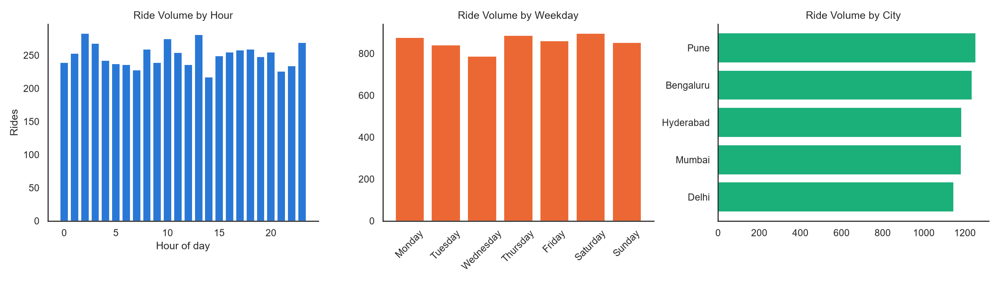
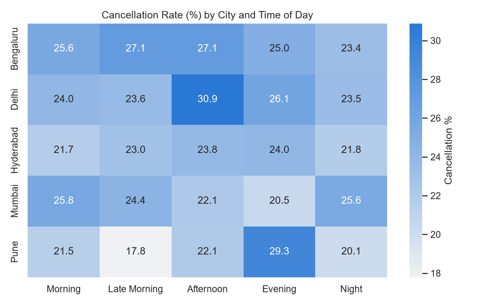
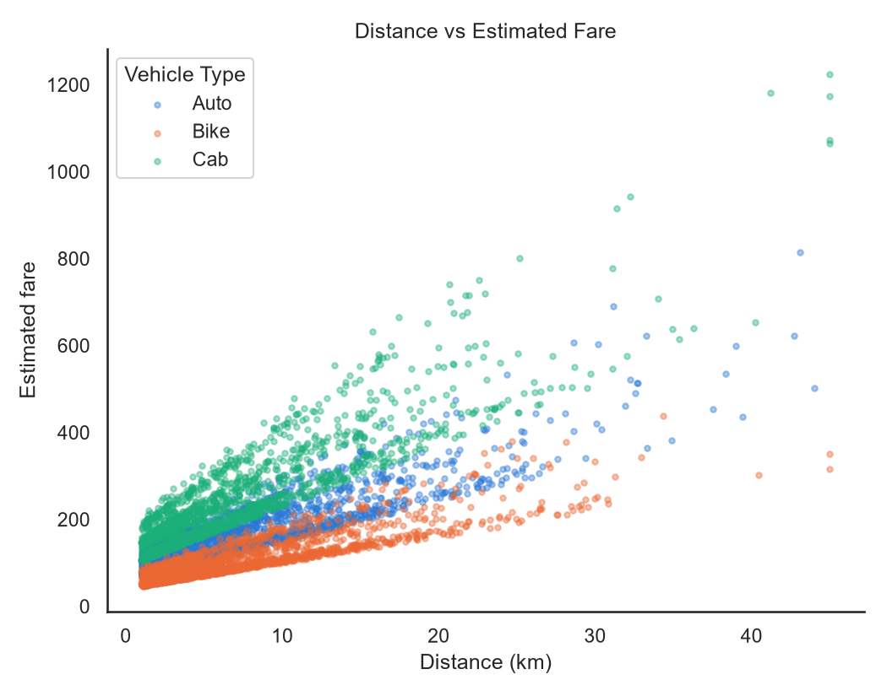
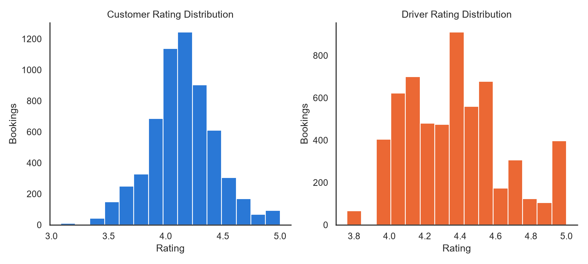
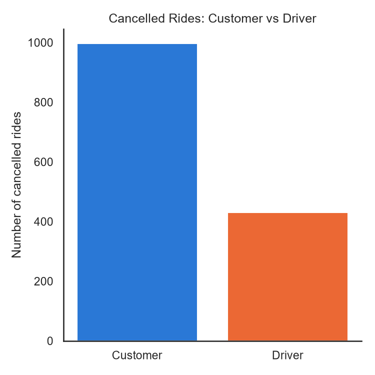
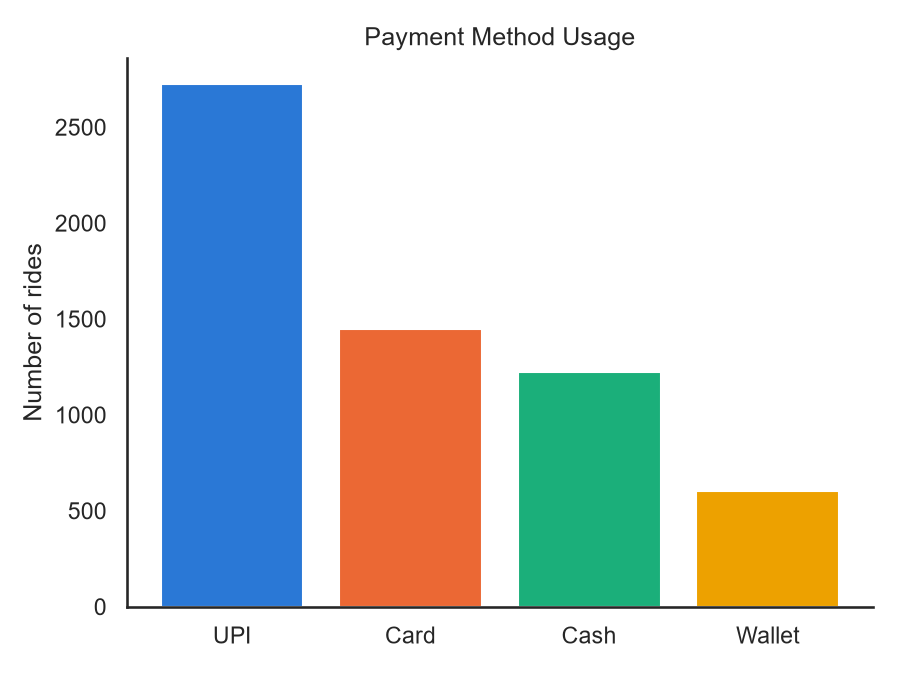
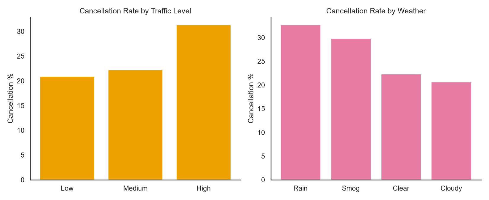

# EDA Report - Rapido Intelligent Mobility Insights

Dataset: **6,000** bookings across 5 cities, 389 customers, 150 drivers.
Overall cancellation rate: **23.8%**.

## Ride Volume by Hour, Weekday & City

Peak hour: **2:00**. Busiest city: **Pune** (1,253 rides).

## Cancellation Heatmap Across Cities

Cancellation rate broken down by city and time-of-day bucket - useful for spotting whether a city's higher overall cancellation rate is concentrated in specific hours or spread evenly.

## Distance vs Fare Correlation

Correlation coefficient: **0.713**. Strongly positive, as expected - fare is built directly from distance in this dataset, so the relationship is close to linear within each vehicle type, with the vehicle-type bands visible as roughly parallel clusters.

## Rating Distribution

Mean customer rating: **4.15**. Mean driver rating: **4.37**.

## Customer vs Driver Cancellation Behavior

Of all cancelled rides, customers initiated **996** and drivers initiated **430**.

## Payment Method Usage

Most used: **UPI** (45.4% of rides).

## Traffic & Weather vs Cancellation

Cancellation rate is highest in **High** traffic (31.3%) and during **Rain** weather (32.7%) - both feed directly into the cancellation-risk features used by the model in src/train_model.py.